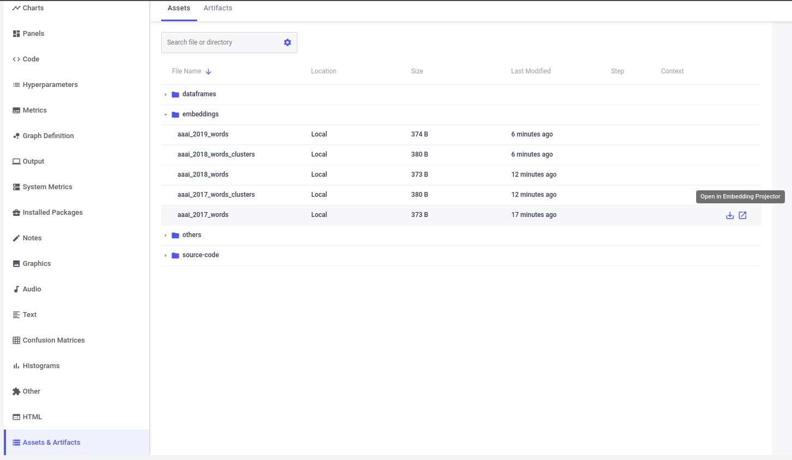

# AI Papers Analysis

Trying to understand trends in the latest AI papers.

## Requirements

[Docker](https://www.docker.com/) or, for local installation:

- Python 3.10+
- [Poetry](https://python-poetry.org/docs/)

> Note: Poetry installation currently not working due to [a bug when installing fasttext](https://github.com/facebookresearch/fastText/pull/1292).

## Usage

To make it easier to run the code, with or without Docker, I created a few helpers. Both ways use `start_here.sh` as an entry point. Since there are a few quirks when calling the specific code, I created this file with all the necessary commands to run the code. All you need to do is to uncomment the relevant lines and run the script:

```bash
cluster_conferences=1
find_words_usage_over_conf=1
```

### Running without Docker

You first need to install [Python Poetry](https://python-poetry.org/docs/). Then, you can install the dependencies and run the code:

```bash
poetry install
bash start_here.sh
```

### Running with Docker

To help with the Docker setup, I created a `Dockerfile` and a `Makefile`. The `Dockerfile` contains all the instructions to create the Docker image. The `Makefile` contains the commands to build the image, run the container, and run the code inside the container. To build the image, simply run:

```bash
make
```

To call `start_here.sh` inside the container, run:

```bash
make run
```

## Data

The data used in this project is the result from running [AI Papers Search Tool](https://github.com/george-gca/ai_papers_search_tool). We need both the `data/` and `model_data/` directories.

## Code Explanation

All the work is done based on the abstracts of the papers. It uses the [fasttext](https://fasttext.cc/) library to build paper representations, [t-SNE](https://scikit-learn.org/stable/modules/generated/sklearn.manifold.TSNE.html) to reduce the dimensionality of the data, and [k-means](https://scikit-learn.org/stable/modules/generated/sklearn.cluster.KMeans.html) to cluster the papers.

### cluster_conference_papers.py

This script clusters the papers from a specific conference/year.

### cluster_conference_words.py

This script clusters the words from a specific conference/year.

### cluster_filtered_papers.py

This script clusters the papers that contain a specific word or similar words.

## Visualizing Data

The best way to visualize the embeddings is through the [Embedding Projector](https://projector.tensorflow.org/), which I use inside [Comet](https://www.comet.ml/). If you want to use Comet, just create a file named `.comet.config` in the root folder here, and add the following lines:

```config
[comet]
api_key=YOUR_API_KEY
```

An example of these experiments logged in Comet can be found [here](https://www.comet.com/george-gca/ai-papers/). To visualize the embeddings, click on the experiment on the left, then navigate to `Assets & Artifacts`, open the `embeddings` directory, and click `Open in Embedding Projector`.



## TODO
- create n-gram from abstracts before clustering